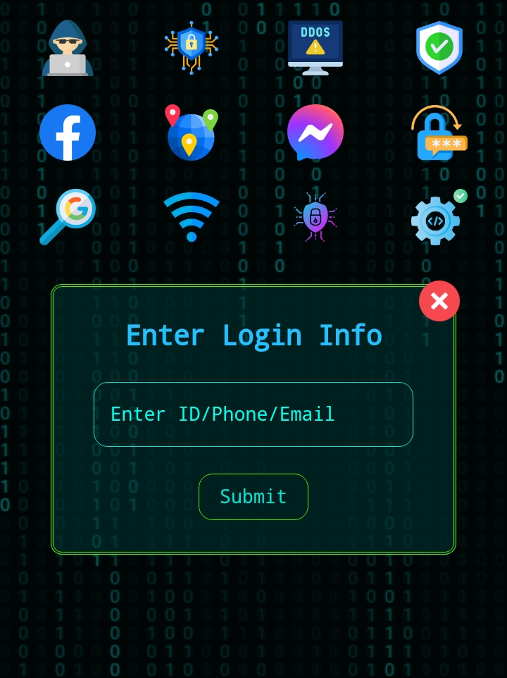
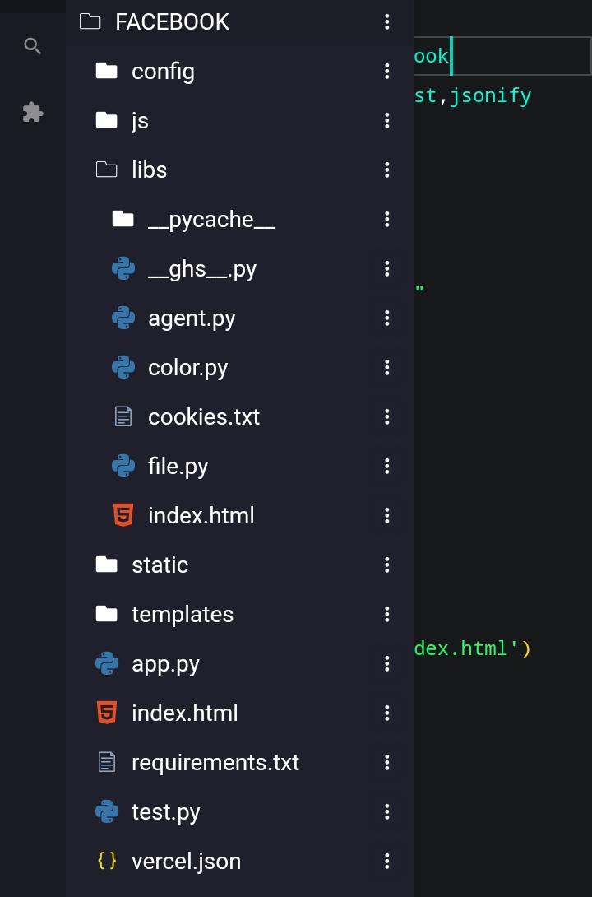
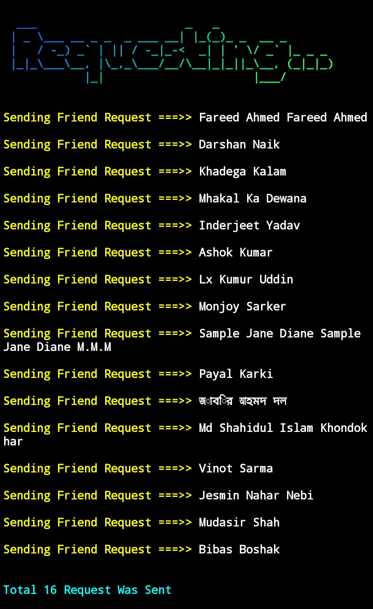
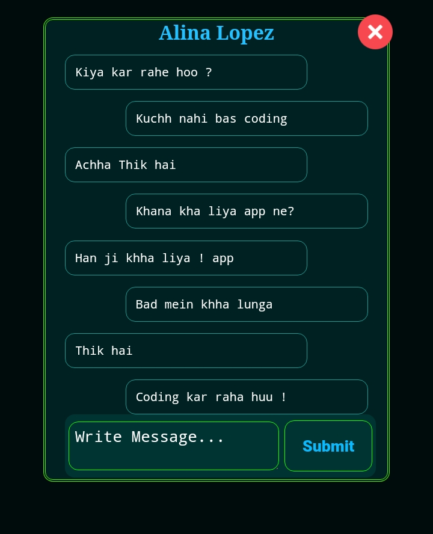

<center>
<h1> Facebook Automation</h1><br><br><br>
<h1>Developer : Ghs Julian</h1>

<strong>
  This is a Facebook Automation using python. You can automate your Facebook
  account using this tools . It's Awesome 😎 . You can manage your Facebook
  account easily.
</strong>
<br><br>
<h1> Features And Uses</h1>


```html
[1] View Inbox
[2] Send Messages 
[3] Send Friend Requests
[4] Write Post
[5] Get Profile Info 
```

<br><br>
<h1> Installation & Command</h1>
<br>

```bash
git clone https://github.com/Ghsjulian/Facebook.git && cd Facebook && pip install -r requirements.txt && python app.py
```

<br>
<strong> Bassic Examples Of Code...</strong><br><br>

```python
import json
from libs.__ghs__ import Facebook
from flask import Flask, request,jsonify,render_template

app = Flask(__name__)
email = "your_email"
password = "your_password"
fb = Facebook(email, password)
#fb.friend_request()

@app.route('/')
def index():
    return render_template('index.html')


@app.route('/chat_list')
def chat_list():
    #return render_template('index.html')
    chat_list = fb.message()
    user_info = json.dumps(str(chat_list))
    cnvrt_data = json.loads(user_info)
    return jsonify(chat_list)


```

<br><br>

<strong> Methods And Object : </strong>

```python
from libs.__ghs__ import Facebook

email = "your_email"
password = "your_password"
fb = Facebook(email, password)


fb.friend_request()
# It will send friend request...

fb.__Chatbox__("recipient url")
# Enter A users msg url...

fb.__Inbox__()
# It Will Open Inbox...

fb.check_login()
# Check If User Login Or Not...

fb.get_cookies("c_user")
# Get The User Id From Cookies...

````


<br><br>
<h1>Demo & Screenshots</h1>

<br><br>
<br><br>
<br><br>



</center>